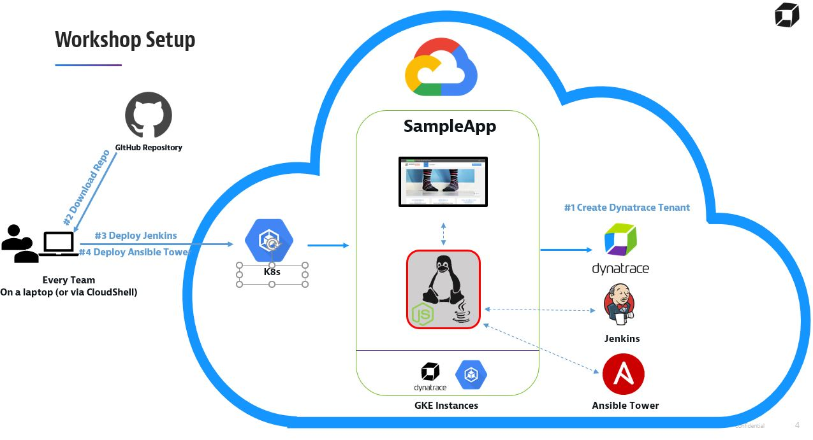

# Dynatrace ACM Workshop
Unbreakable DevOps Pipeline Tutorial with Self-Healing using Kubernetes, Jenkins, JMeter, Ansible Tower, and Dynatrace

The goal of this tutorial is having a full end-to-end DevOps Pipeline (Staging, Approval, Production) that is fully monitored with Dynatrace. With Dynatrace injected into the pipeline we implement the following use cases:
1. **FullStack** Monitor your **Staging** Environment
2. **Shift-Left**: Automate Approve/Reject Promotion from Staging to Production based on Performance Data captured while running continuous performance tests
3. **FullStack** Monitor your **Production** Environment
4. **Self-Healing**: Automatic Deploy of previous revision in case Dynatrace detected problems in Production

## Pre-Requisites
1. You will need either a GCP or Azure account, and access to the cloud providers cloud shell.
1. You will need a Dynatrace Account. Get your [Free SaaS Trial here!](https://www.dynatrace.com/trial/)
1. You will need an Ansible Tower license. [Get a Free license here.](https://www.ansible.com/workshop-license)
1. You will need to copy the contents of thie GitHub repo to your cloud shell instance

## What are we going to accomplish
The workshop create a 3 node Kubernetes cluster on either GCP or AKS which will host a Dev and Production instance of our sample application, SockShop.  Using Jenkins we will build a pipeline to deploy new versions of our application.  In order to ensure we don't deploy builds that will impact our customers, we will integration Dynatrace Quality Gates to keep bad builds out of Production.
We will then create a "self-healing" pipeline using Dynatrace and Ansible Tower.  If a bad build does make it's way into production or a feature-flag doesn't work as intended, Dynatrace will automatically detect this problem and trigger a remediation job via Ansible Tower.

More detailed steps can be found in the [PowerPoint Deck with the repo](DynatraceACM.pptx).

